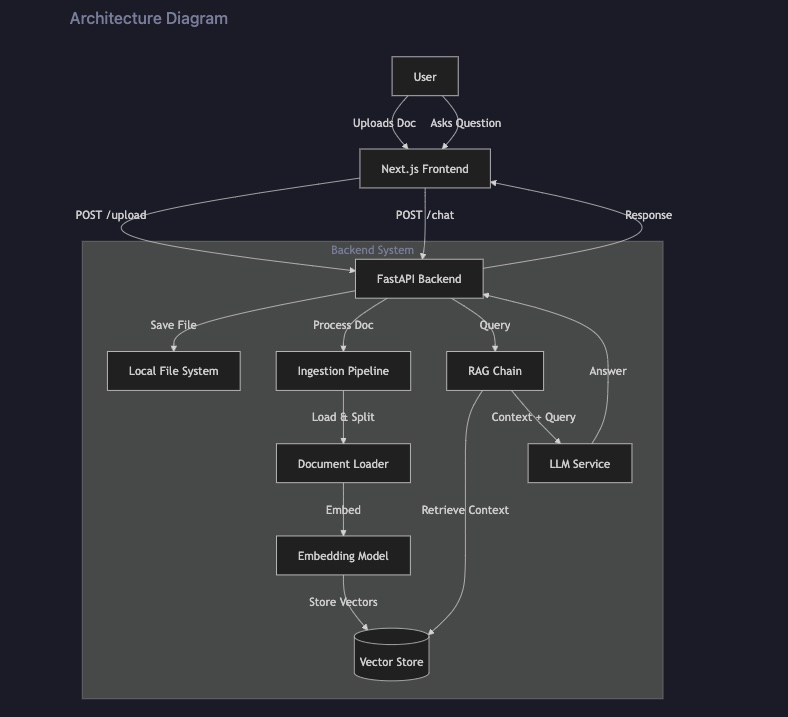
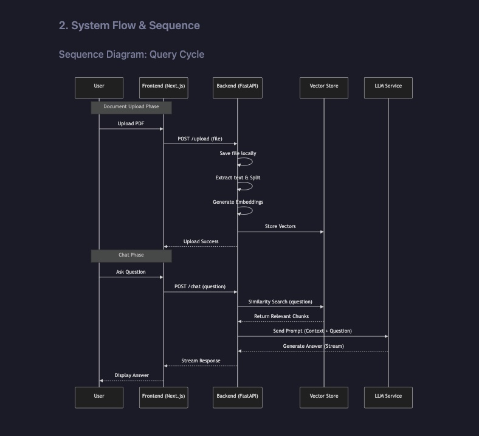

# RAG FAQ Application

A Retrieval-Augmented Generation (RAG) based FAQ system that allows users to upload documents (PDF, DOC/DOCX) and ask questions via a chat interface.

Built with **Next.js**, **FastAPI**, and **LangChain**.

---

## ✨ Features

- 📄 Upload PDF / DOC / DOCX documents
- 💬 Chat-based Q&A over uploaded documents
- 🔎 Semantic search with vector embeddings
- 🧠 Context-aware answers using LLMs
- ⚡ Fast, local vector storage

---

## 🏗 Architecture Overview

```
Frontend (Next.js)
      │
      │  Upload / Chat
      ▼
Backend API (FastAPI)
      │
      │  RAG Pipeline
      ▼
LangChain
  ├─ Document Loader
  ├─ Text Splitter
  ├─ Embeddings
  └─ Retriever
      │
      ▼
Vector Store (ChromaDB / FAISS)
      │
      ▼
LLM (OpenAI / Gemini)
```




---

## 🧰 Tech Stack

**Frontend**
- Next.js
- React

**Backend**
- FastAPI
- LangChain
- ChromaDB / FAISS

**LLM Providers**
- OpenAI
- Gemini (optional)

---

## 📦 Prerequisites

- Node.js v18+
- Python v3.9+
- OpenAI API Key

---

## 📁 Project Structure

```
rag_faq_app/
├── backend/
│   ├── app/
│   ├── chroma_db/
│   ├── uploads/
│   ├── requirements.txt
│   └── .env
└── frontend/
    ├── app/
    ├── components/
    └── package.json
```

---

## 🚀 Getting Started

### Backend

```bash
cd rag_faq_app/backend
python -m venv venv
source venv/bin/activate
pip install -r requirements.txt
uvicorn app.main:app --reload
```

### Frontend

```bash
cd rag_faq_app/frontend
npm install
npm run dev
```

---

## 🧪 Usage

1. Upload document
2. Ask questions
3. Get grounded answers

---
## 🧪 Notes

1. The vector database is stored locally in rag_faq_app/backend/chroma_db.
2. Uploaded files are saved in rag_faq_app/backend/uploads.

---

## Need to improve
- Metadata Filtering: Filter retrieval by filename/date.
- Hybrid Search: Combine keyword search (BM25) with semantic search.
- History Aware: Pass chat history to the LLM for context-aware follow-up questions.
- Async Processing: Use background tasks (Celery/RQ) for processing large files to avoid blocking the API.
- Source Highlighting: Return page numbers and highlight text in the UI.

---

## 📄 License

MIT
